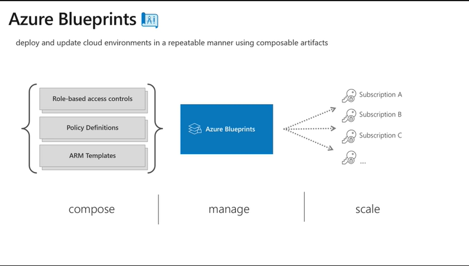

# Azure Blueprints

## What are Blueprints?

- Azure Blueprints is a container or packaging of deployment artifacts, *ARM templates*, *RBAC assignments* and *Azure Policies*.  
- Allows you to stamp out and mantain your Azure environments in a **consistent** and **repeatable** manner.    

## What about ARM?
- ARM templates is a first class citizen to the provision Azure workloads
- ARM falls short when environments increase in complexity causing your ARM templates to become less modular or when the number of environments increases thus making it difficult to keep up to date.
- One way to address this is implement an orchestration system, say in Powershell to manage the Templates, but there's a better way - enter Blueprints!
  

## Why Blueprints?
- [ ] A **native Azure offering** that is meant to provision and maintain environments in Azure.
- [ ] **Track and audit deployments**.  Keep track of *What was deployed?* vs *What should be deployed?*. 
- [ ] **Save to an Azure Management Group** and assign the Blueprint to any of its child subscriptions.
- [ ] **Upgrade several subscriptions at once** governed by the same Blueprint.
- [ ] **Assign different versions** of the same Blueprint to the same subscription.
- [ ] **Support parameters**.  Defined at the Blueprint level, paremeters are accessible to all its artifacts (ARM templates, policies, resource groups, RBAC assignments) contained within the Blueprint.
- [ ] Modulizes ARM templates and maintain each under its own lifecycle; **avoid monolithic ARM template**.
- [ ] **Lock your environment** so only the Blueprint definition can modify its resources. Even subscription owners cannot modify!
- [ ] **Manage Blueprints as code** and enjoy all the goodies that entails, i.e. compose them in Visual Studio, store and collaborate using a Git repo, execute as a Azure DevOps pipeline.

## Keep an eye out for what's next in Blueprints
- [ ] More advanced Assignment updates
  - What-if analysis updates
  - Resource delete
- [ ] Advanced resource locking
  - Configure the artifacts to be locked instead of the whole assignment
- [ ] Pre/Post deployment script execution
- [ ] Advanced sequencing
  - Passing values between artifacts
- [ ] Better import/export experience for sharing Blueprints accross tenants
- [ ] Support for assigning Blueprints to a Management Group
- [ ] Powershell cmdlets and CLI commands

### References
- aka.ms/whatareblueprints
- aka.ms/blueprintsdeepdive
- aka.ms/blueprintsascode
  
